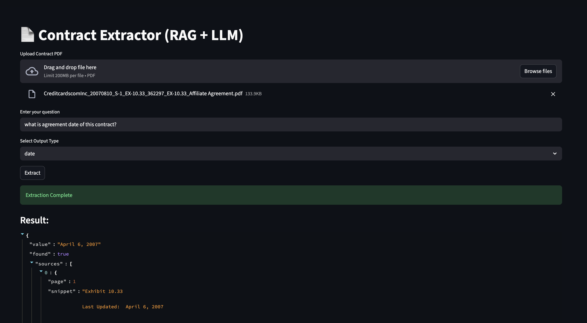

# Contract Extractor RAG System

A production-ready system for legal contract extraction using Retrieval-Augmented Generation (RAG) with LangChain, FAISS, the CUAD QA model, and OpenAI.

## Features

- **Contract Parsing:** Chunk and parse legal contracts for downstream processing using Recursive Chunking strategy.
- **Retrieval:** Efficient document retrieval using FAISS and CUAD model vector embeddings.
- **Question Answering:** Extract contract clauses and answers using OpenAI.
- **Postprocessing:** Clean and calibrate extracted information for accuracy.

## Directory Structure

- `core/` — Extraction and pipeline logic
- `parsing/` — Contract chunking and parsing modules
- `processing/` — Postprocessing utilities
- `qa/` — Question answering using LLMs
- `retrieval/` — Embeddings, retriever, and vector index

## Installation

```bash
pip install -r requirements.txt
```

## How to Use?
1. **Setup Environment Variables**

   Create a `.env` file in the project root with the following content & export it in your environment.

   ```bash
   OPENAI_API_KEY=your_openai_api_key
   HF_TOKEN=hugging face_token
   ```
   
2. **Run StreamLit**

   ```bash
    streamlit run app.py
    ```

## StreamLit Interface Look
The StreamLit interface allows users to upload a legal contract, ask questions about its content, and view the extracted answers in a user-friendly format. The system leverages the power of RAG to provide accurate and relevant responses based on the contract's content.


